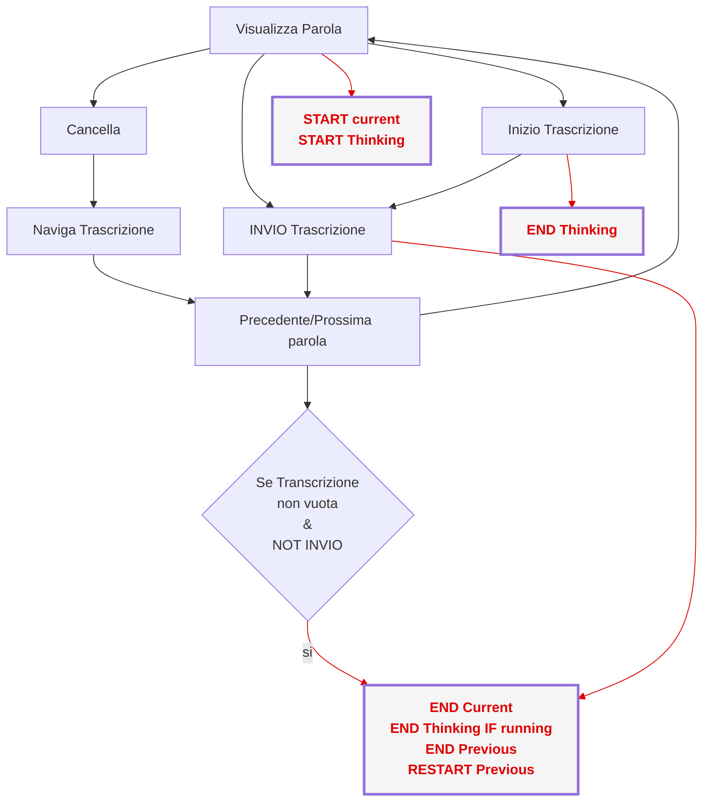

# ⏲️ Registrazione dei tempi di trascrizione

Librarius registra automaticamente i tempi impiegati dall’utente durante le attività di trascrizione.
I tempi vengono salvati in un file di log separato per ogni sessione di trascrizione.

## File di log

I file di log sono memorizzati nella directory:

```
data/logs
```

Il nome del file contiene la data e l’ora di inizio della sessione.
Esempio:

```
2026-2-19-16-18-27_words_timing.csv
```

## Sessioni di trascrizione

Una sessione di trascrizione:

* **inizia** quando l’utente seleziona un documento dalla lista dei documenti disponibili;
* può includere la trascrizione di **più documenti**, semplicemente selezionandoli uno dopo l’altro;
* **termina** quando:

  * l’applicazione viene chiusa, oppure
  * l’utente interrompe la trascrizione tornando alla schermata *Home*.

In altre parole, è possibile mettere in pausa una sessione tornando alla schermata Home senza chiudere Librarius.


## Struttura del file di log

Il file di log è in formato CSV. Esempio:

```csv
OP,Doc_ID,line_ID,word_ID,transcript,mode,time_currentword_s,time_from_prevword_s,thinking_time
HTR,001,HTR-Transcription,,'',TRANSCRIBE,16.36031484603882,,
tr,001,0000,0,'6#The',OK,33.40970730781555,0,33.40974998474121
DEL,001,0000,1,,DELETE,,,
tr,001,0000,1,'evidence',OK,2.275792121887207,9.398285627365112,2.27579927444458
...
SESSION,,,,'',SESSION_TIME,74.5226981639862,,
```

i tempi sono tutti riportati in **secondi**.


### Colonna `OP`

La colonna `OP` indica il tipo di operazione registrata:

* **HTR** — tempo necessario al sistema per generare la trascrizione automatica
* **tr** — operazione di trascrizione o correzione di una parola da parte dell’utente
* **DEL** — cancellazione di una parola
* **SESSION** — durata totale della sessione. Sempre riportato nell'ultima riga del file. 


# Dettaglio delle operazioni di trascrizione (`tr`)

Le righe con `OP = tr` registrano l’interazione dell’utente su una singola parola.

## Identificazione della parola

* **Doc_ID** — identificativo del documento
* **line_ID** — identificativo della riga
* **word_ID** — indice della parola nella riga
  (intero a partire da 0, dalla parola più a sinistra)


## Informazioni sulla trascrizione

* **transcript** — testo inserito o confermato dall’utente
* **mode** — modalità di conferma della trascrizione:

  * `OK` — click sul pulsante OK
  * `ENTER` — tasto Invio
  * `SPACE` — tasto Spazio
  * `NEXT` — Alt + Freccia destra oppure pulsante Next
  * `PREV` — Alt + Freccia sinistra oppure pulsante Prev
  * `LIST_n` — selezione dell’opzione n nella lista di suggerimenti
    (n = 0 è l’opzione più in alto)


## Tempi registrati

* **time_currentword_s**
  Tempo di trascrizione della parola: dall’apparizione a schermo alla conferma.

* **time_from_prevword_s**
  Tempo trascorso tra la conferma della parola precedente e quella corrente.
  Include eventuali azioni intermedie (navigazione tra parole, cancellazioni, ecc.).

* **thinking_time**
  Tempo tra la visualizzazione della parola e la prima interazione dell’utente
  (inizio digitazione o azione di conferma).

  Se l’utente conferma la parola senza modificarla (es. premendo Invio),
  questo valore coincide con `time_currentword_s`.


## Flusso della sessione di trascrizione
(Assicurati che il tuo visualizzatore di file .md possa visualizzare shemi mermaid. Se usi Vs Code, installa l'estensione "Markdown Preview Mermaid Support")

